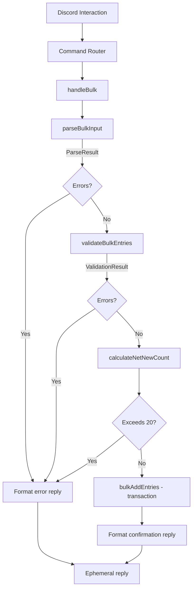

# Design Document: Bulk Schedule Command

## Overview

The `/schedule bulk` command adds a multi-entry submission flow to the existing Discord Stream Schedule Bot. Instead of invoking `/schedule add` once per entry, streamers paste a multi-line text block where each line follows `Day HH:MM Title`. The bot parses, validates, and atomically stores all entries in a single database transaction.

The design introduces three new pure modules — a **parser**, a **pretty-printer**, and a **bulk validator/orchestrator** — that sit between the Discord command handler and the existing `ScheduleService`. These modules are intentionally kept as pure functions (no I/O) so they can be thoroughly tested with property-based tests.

### Key Design Decisions

| Decision | Rationale |
|----------|-----------|
| Pure parser module separate from command handler | Enables property-based testing without Discord mocks |
| Pretty-printer as inverse of parser | Enables round-trip correctness verification |
| Pre-check net-new count before transaction | Avoids partial writes and rollback overhead in the happy path |
| Single `db.transaction()` wrapper | better-sqlite3's synchronous transaction API makes atomic bulk insert straightforward |
| Reuse existing validators unchanged | Maintains consistency with `/schedule add` behavior |

## Architecture



The bulk command handler orchestrates a pipeline:
1. **Parse** — split raw text into structured entry data
2. **Validate** — check day/time/title constraints and entry count limits
3. **Pre-check** — calculate net new entries accounting for UPSERT replacements
4. **Store** — wrap all `addEntry` calls in a single SQLite transaction
5. **Respond** — format a confirmation or error message

## Components and Interfaces

### 1. Parser Module (`src/utils/bulk-parser.ts`)

```typescript
/** A single parsed entry line (unvalidated). */
export interface ParsedEntry {
  day: string;
  startTime: string;
  title: string;
  lineNumber: number; // 1-based
}

/** Result of parsing a single line. */
export type LineParseResult =
  | { ok: true; entry: ParsedEntry }
  | { ok: false; lineNumber: number; raw: string; error: string };

/** Result of parsing the full bulk input. */
export interface BulkParseResult {
  entries: ParsedEntry[];
  errors: LineParseResult & { ok: false }[];
}

/**
 * Splits bulk input text into parsed entries.
 * Skips blank/whitespace-only lines.
 * Reports errors for lines with fewer than 3 tokens.
 */
export function parseBulkInput(input: string): BulkParseResult;
```

Parsing rules:
- Split on `\n` (handles `\r\n` by trimming each line)
- Skip lines that are empty or whitespace-only after trimming
- First whitespace-delimited token → `day`
- Second whitespace-delimited token → `startTime`
- Remainder of line (trimmed) → `title`
- Lines with fewer than 3 tokens produce an error identifying line number and raw content

### 2. Pretty-Printer Module (`src/utils/bulk-printer.ts`)

```typescript
import { ParsedEntry } from './bulk-parser';

/**
 * Formats structured entries back into bulk input text.
 * Inverse of parseBulkInput for round-trip verification.
 */
export function formatBulkEntries(entries: ParsedEntry[]): string;
```

Formatting rules:
- Each entry → `${day} ${startTime} ${title}`
- Entries joined with `\n`
- Empty list → empty string `""`

### 3. Bulk Validator (`src/utils/bulk-validator.ts`)

```typescript
import { ParsedEntry } from './bulk-parser';

export interface BulkValidationError {
  lineNumber: number;
  field: 'day' | 'time' | 'title';
  message: string;
}

export interface BulkValidationResult {
  valid: boolean;
  errors: BulkValidationError[];
  /** Entries with day normalized to proper case (e.g., "monday" → "Monday") */
  normalizedEntries: NormalizedEntry[];
}

export interface NormalizedEntry {
  day: DayOfWeek;
  startTime: string;
  title: string;
  lineNumber: number;
}

/**
 * Validates all parsed entries against day/time/title rules.
 * Accumulates all errors (does not short-circuit).
 * Also enforces the max 20 entry lines per submission limit.
 */
export function validateBulkEntries(entries: ParsedEntry[]): BulkValidationResult;
```

Validation uses existing `validateDay`, `validateTime`, and `validateTitle` from `src/utils/validators.ts`. Day values are normalized to the `DayOfWeek` enum casing on success.

### 4. Bulk Storage (`src/services/schedule-service.ts` — extended)

```typescript
export interface BulkAddResult {
  added: number;
  replaced: number;
  entries: ScheduleEntry[];
}

/**
 * New method on ScheduleService.
 * Stores all entries in a single transaction.
 * Pre-checks net new count against the 20-entry limit.
 * 
 * @throws Error if net new entries would exceed limit
 * @throws Error if any entry fails to store (full rollback)
 */
bulkAddEntries(
  guildId: string,
  userId: string,
  username: string,
  entries: NormalizedEntry[],
  weekId: string
): BulkAddResult;
```

Net new calculation:
```
existingCount = getEntryCount(guildId, userId, weekId)
replacements = entries that match an existing (guildId, userId, day, startTime, weekId)
netNew = entries.length - replacements
if (existingCount + netNew > 20) → reject
```

### 5. Response Formatter (`src/utils/bulk-response.ts`)

```typescript
import { ScheduleEntry } from '../types';
import { BulkValidationError } from './bulk-validator';
import { LineParseResult } from './bulk-parser';

/**
 * Formats a success confirmation message.
 * Lists entries ordered by day (Mon→Sun) then time.
 * Truncates if message would exceed 2000 characters.
 */
export function formatBulkConfirmation(
  entries: ScheduleEntry[],
  weekId: string
): string;

/**
 * Formats validation errors into an ephemeral error message.
 * Each error on its own line prefixed with "Line N: ...".
 */
export function formatBulkErrors(
  parseErrors: (LineParseResult & { ok: false })[],
  validationErrors: BulkValidationError[]
): string;

/**
 * Formats a "no entries provided" error.
 */
export function formatNoEntriesError(): string;

/**
 * Formats the limit-exceeded error showing current count and max.
 */
export function formatLimitExceededError(
  currentCount: number,
  attemptedNew: number,
  max: number
): string;
```

### 6. Command Handler (`src/commands/schedule.ts` — extended)

A new `handleBulk` function added to the existing schedule command handler, invoked when `subcommand === 'bulk'`. Follows the same pattern as `handleAdd`/`handleRemove`/`handleMine`.

### 7. Command Registration (`src/commands/index.ts` — extended)

Add a `bulk` subcommand to the `/schedule` command group:

```typescript
command.addSubcommand((sub) =>
  sub
    .setName('bulk')
    .setDescription('Add multiple schedule entries at once')
    .addStringOption((option) =>
      option
        .setName('entries')
        .setDescription('Your schedule entries, one per line: Day HH:MM Title')
        .setRequired(true)
        .setMaxLength(6000)
    )
);
```

## Data Models

### ParsedEntry (internal, transient)

| Field | Type | Description |
|-------|------|-------------|
| day | `string` | Raw day token from input (not yet validated) |
| startTime | `string` | Raw time token from input |
| title | `string` | Remaining text after day and time |
| lineNumber | `number` | 1-based position in original input |

### NormalizedEntry (internal, transient)

| Field | Type | Description |
|-------|------|-------------|
| day | `DayOfWeek` | Validated and normalized day enum value |
| startTime | `string` | Validated HH:MM time |
| title | `string` | Validated title (1-100 chars) |
| lineNumber | `number` | Original line number (preserved for error reporting) |

### ScheduleEntry (existing, persisted)

No schema changes needed. The existing `schedule_entries` table and `ScheduleEntry` type are reused as-is. The UPSERT logic on `(guild_id, user_id, day, start_time, week_id)` handles replacements transparently.

### BulkAddResult (internal, transient)

| Field | Type | Description |
|-------|------|-------------|
| added | `number` | Count of net-new entries inserted |
| replaced | `number` | Count of existing entries whose title was updated |
| entries | `ScheduleEntry[]` | All resulting entries (both new and updated) |


## Correctness Properties

*A property is a characteristic or behavior that should hold true across all valid executions of a system — essentially, a formal statement about what the system should do. Properties serve as the bridge between human-readable specifications and machine-verifiable correctness guarantees.*

### Property 1: Parse/Format Round-Trip

*For any* list of valid entries (where each entry has a valid day name, a valid HH:MM time, and a non-empty title containing no newline characters), formatting the list with the pretty-printer and then parsing the result shall produce an equivalent list of entries with identical day, startTime, and title values in the same order.

**Validates: Requirements 2.1, 2.2, 2.5, 5.1, 5.2, 5.3**

### Property 2: Blank Line Filtering

*For any* bulk input string, lines that are empty or contain only whitespace characters shall not produce parsed entries and shall not produce parse errors — the parser's output entries count shall equal the number of non-blank lines that contain at least 3 tokens.

**Validates: Requirements 2.4**

### Property 3: Incomplete Line Parse Error

*For any* input line containing fewer than 3 whitespace-delimited tokens (but at least 1 non-whitespace character), the parser shall produce an error result identifying the correct 1-based line number and the raw line content.

**Validates: Requirements 2.3**

### Property 4: Validation Error Accumulation

*For any* list of parsed entries where one or more entries have an invalid day, invalid time, or invalid title, the bulk validator shall report an error for every invalid field across all entries — the count of validation errors shall equal the total number of invalid fields across all entries, and each error shall reference the correct 1-based line number.

**Validates: Requirements 3.1, 3.2, 3.3, 3.4**

### Property 5: Case-Insensitive Day Normalization

*For any* valid day name in any case combination (e.g., "monday", "TUESDAY", "wEdNeSdAy"), the bulk validator shall accept the entry and normalize the day to its canonical `DayOfWeek` enum form (e.g., "Monday", "Tuesday", "Wednesday").

**Validates: Requirements 3.5**

### Property 6: Entry Line Count Limit

*For any* bulk input containing more than 20 non-blank entry lines, the validator shall reject the entire submission with an error indicating the maximum of 20 entry lines was exceeded, regardless of whether individual entries are valid.

**Validates: Requirements 1.4, 3.7**

### Property 7: Net New Count Enforcement

*For any* combination of existing entry count E (0 ≤ E ≤ 20), submitted entries S, and replacement count R (entries matching an existing day+startTime), the bulk storage shall accept the submission if and only if E + (|S| - R) ≤ 20. When the condition is violated, no entries shall be stored.

**Validates: Requirements 3.6, 4.2, 4.3**

### Property 8: Confirmation Message Formatting

*For any* successful bulk storage of 1 or more entries, the confirmation message shall contain the entry count, the week ID, and each entry listed on its own line ordered first by day (Monday through Sunday) then by start time (lexicographic ascending within same day).

**Validates: Requirements 6.1, 6.2**

### Property 9: Message Truncation

*For any* set of stored entries, the formatted confirmation message shall never exceed 2000 characters. When truncation occurs, the message shall end with a line indicating how many additional entries are not shown.

**Validates: Requirements 6.3**

### Property 10: Error Message Line Numbering

*For any* set of validation or parse errors, the formatted error message shall contain one line per error, and each line shall be prefixed with `Line N:` where N is the 1-based line number of the failing entry in the original input.

**Validates: Requirements 6.4**

### Property 11: All-Whitespace Input Rejection

*For any* input string composed entirely of whitespace characters and newlines (i.e., no non-whitespace content), the parser shall produce zero entries and the bot shall respond with a "no entries provided" error.

**Validates: Requirements 6.6**

## Error Handling

| Scenario | Handler | Response |
|----------|---------|----------|
| Parse error (< 3 tokens on a line) | `parseBulkInput` | Ephemeral message listing parse errors by line number |
| Validation error (bad day/time/title) | `validateBulkEntries` | Ephemeral message listing all validation errors |
| Submission > 20 entry lines | `validateBulkEntries` | Ephemeral error: "Maximum of 20 entries per submission exceeded" |
| Net new would exceed 20/week limit | `bulkAddEntries` pre-check | Ephemeral error: "You have N entries this week. Adding M new entries would exceed the limit of 20." |
| All lines blank/whitespace | `handleBulk` | Ephemeral error: "No entries provided." |
| Database transaction failure | `bulkAddEntries` rollback | Ephemeral error: "Failed to save entries. Please try again." |
| Confirmation > 2000 chars | `formatBulkConfirmation` | Truncate list, append "…and N more entries" |

Error precedence (checked in order):
1. No entries provided (all blank)
2. Parse errors (< 3 tokens)
3. Entry count > 20 lines
4. Validation errors (day/time/title)
5. Net new count would exceed weekly limit
6. Database storage failure

When validation errors exist, ALL errors are accumulated and returned together. The system never stores partial results — the entire submission is atomic.

## Testing Strategy

### Property-Based Tests (fast-check, minimum 100 iterations each)

| Property | Test File | Generator Strategy |
|----------|-----------|-------------------|
| 1: Round-trip | `tests/properties/bulk-parser.prop.ts` | Generate lists of `{day, time, title}` with valid values |
| 2: Blank line filtering | `tests/properties/bulk-parser.prop.ts` | Intersperse valid entries with random whitespace lines |
| 3: Incomplete line error | `tests/properties/bulk-parser.prop.ts` | Generate 1-2 token lines |
| 4: Validation accumulation | `tests/properties/bulk-validator.prop.ts` | Generate mixed valid/invalid entries |
| 5: Case normalization | `tests/properties/bulk-validator.prop.ts` | Generate day names with random casing |
| 6: Entry count limit | `tests/properties/bulk-validator.prop.ts` | Generate 21-30 entry lists |
| 7: Net new count | `tests/properties/bulk-storage.prop.ts` | Generate existing + proposed entry sets with overlap |
| 8: Confirmation format | `tests/properties/bulk-response.prop.ts` | Generate entry lists, verify order |
| 9: Truncation | `tests/properties/bulk-response.prop.ts` | Generate large entry sets |
| 10: Error line numbering | `tests/properties/bulk-response.prop.ts` | Generate errors at random positions |
| 11: All-whitespace rejection | `tests/properties/bulk-parser.prop.ts` | Generate whitespace-only strings |

Each property test MUST:
- Use `fc.assert(fc.property(...), { numRuns: 100 })` minimum
- Include a comment tag: `// Feature: bulk-schedule-command, Property N: <title>`
- Reference the design property it validates

### Unit Tests (vitest)

| Area | Test File | Coverage |
|------|-----------|----------|
| Parser edge cases | `tests/unit/bulk-parser.test.ts` | CRLF handling, Unicode in titles, max-length titles |
| Validator specifics | `tests/unit/bulk-validator.test.ts` | Boundary times (00:00, 23:59), 100-char titles |
| Command registration | `tests/unit/bulk-command.test.ts` | Subcommand exists with correct options |
| Response formatting | `tests/unit/bulk-response.test.ts` | Specific confirmation/error message examples |

### Integration Tests

| Area | Test File | Coverage |
|------|-----------|----------|
| Full bulk flow | `tests/integration/bulk-flow.test.ts` | Parse → validate → store → confirm end-to-end |
| Transaction rollback | `tests/integration/bulk-flow.test.ts` | Simulated failure mid-transaction |
| UPSERT in bulk | `tests/integration/bulk-flow.test.ts` | Overlapping entries get title updated |
| Limit enforcement | `tests/integration/bulk-flow.test.ts` | Existing entries + bulk doesn't exceed 20 |

### Testing Library

- **Property-based testing**: `fast-check` (already in devDependencies)
- **Test runner**: `vitest` (already configured)
- **Database**: In-memory SQLite via `initializeTestDatabase()` for integration tests
