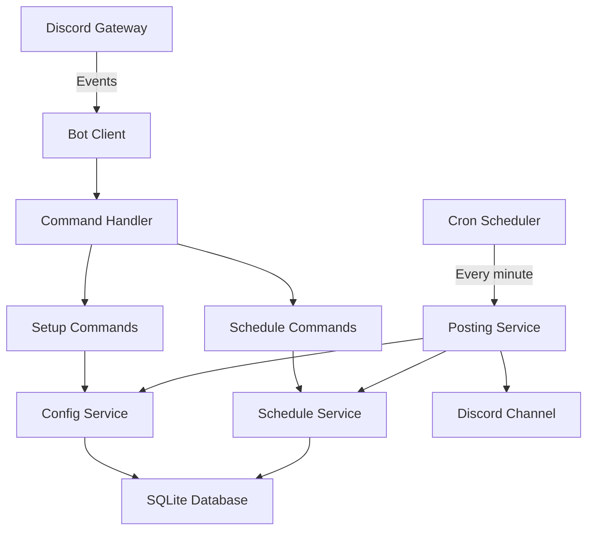
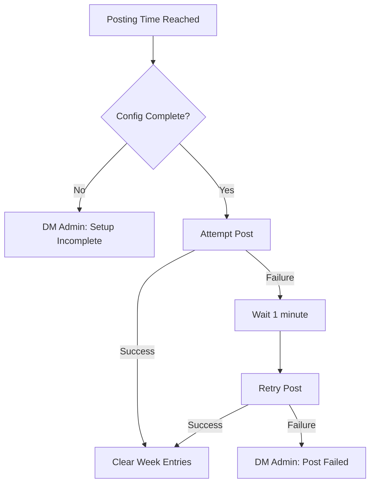

# Design Document: Discord Stream Schedule Bot

## Overview

This document describes the technical design for a Discord bot that automates weekly stream schedule posting. The bot enables server administrators to configure a target channel, posting day, and posting time. Streamers submit their schedule entries throughout the week, and the bot compiles and posts the full schedule at the configured time.

The bot is built as a Node.js application using TypeScript, discord.js v14 for Discord interactions, better-sqlite3 for persistent storage, and node-cron for scheduled task execution.

### Key Design Decisions

- **TypeScript**: Provides type safety across Discord API interactions and data models, reducing runtime errors.
- **discord.js v14**: The standard library for Discord bots in Node.js, with full support for slash commands and modern Discord APIs.
- **better-sqlite3**: Synchronous SQLite library — lightweight, zero-config, and ideal for a bot that operates per-guild with modest data volumes. No external database server required.
- **node-cron**: Handles recurring schedule checks. The bot evaluates every minute whether it's time to post, rather than dynamically rescheduling cron jobs when config changes.
- **Slash Commands**: All user interactions use Discord slash commands for discoverability and built-in validation.

## Architecture



The architecture follows a layered approach:

1. **Command Layer** — Receives Discord slash commands and delegates to services
2. **Service Layer** — Business logic for configuration, schedule management, and posting
3. **Data Layer** — SQLite persistence via a repository pattern
4. **Scheduler Layer** — Minute-by-minute tick that checks if it's time to post

### Scheduling Strategy

Rather than creating a dynamic cron job per guild, the scheduler runs a check every minute. On each tick, it queries all guilds where the current UTC day and time match the configured posting day and time (within a 5-minute window). This approach:
- Handles config changes without needing to reschedule cron jobs
- Naturally supports multiple guilds with different posting times
- Avoids race conditions from dynamic job management

## Components and Interfaces

### Slash Commands

| Command | Subcommand | Options | Permission |
|---------|-----------|---------|------------|
| `/schedule setup` | `channel` | `channel: TextChannel` | Administrator |
| `/schedule setup` | `day` | `day: String (choice)` | Administrator |
| `/schedule setup` | `time` | `time: String` | Administrator |
| `/schedule setup` | `view` | — | Administrator |
| `/schedule add` | — | `day: String (choice)`, `time: String`, `title: String` | Everyone |
| `/schedule remove` | — | `day: String (choice)`, `time: String` | Everyone |
| `/schedule mine` | — | — | Everyone |

### ConfigService

```typescript
interface SetupConfiguration {
  guildId: string;
  channelId: string | null;
  postingDay: DayOfWeek | null;
  postingTime: string | null; // HH:MM in UTC
}

interface ConfigService {
  getConfig(guildId: string): SetupConfiguration;
  setChannel(guildId: string, channelId: string): void;
  setPostingDay(guildId: string, day: DayOfWeek): void;
  setPostingTime(guildId: string, time: string): void;
  isComplete(guildId: string): boolean;
}
```

### ScheduleService

```typescript
interface ScheduleEntry {
  id: number;
  guildId: string;
  userId: string;
  username: string;
  day: DayOfWeek;
  startTime: string; // HH:MM
  title: string;
  weekId: string; // ISO week identifier e.g. "2024-W03"
}

interface ScheduleService {
  addEntry(guildId: string, userId: string, username: string, day: DayOfWeek, startTime: string, title: string): ScheduleEntry;
  removeEntry(guildId: string, userId: string, day: DayOfWeek, startTime: string): boolean;
  getEntriesForWeek(guildId: string, weekId: string): ScheduleEntry[];
  getEntriesForUser(guildId: string, userId: string, weekId: string): ScheduleEntry[];
  getEntryCount(guildId: string, userId: string, weekId: string): number;
  clearWeek(guildId: string, weekId: string): void;
  getCurrentWeekId(config: SetupConfiguration): string;
}
```

### PostingService

```typescript
interface PostingService {
  checkAndPost(): Promise<void>; // Called every minute by scheduler
  formatSchedule(entries: ScheduleEntry[]): string;
  postSchedule(guildId: string): Promise<boolean>;
}
```

### Validation Module

```typescript
interface ValidationResult {
  valid: boolean;
  error?: string;
}

interface Validators {
  validateTime(input: string): ValidationResult;
  validateDay(input: string): ValidationResult;
  validateTitle(input: string): ValidationResult;
  validateEntry(day: string, time: string, title: string): ValidationResult;
}
```

### WeekCalculator

```typescript
interface WeekCalculator {
  getCurrentWeekId(postingDay: DayOfWeek, postingTime: string): string;
  getNextPostingDate(postingDay: DayOfWeek, postingTime: string, from?: Date): Date;
  isPostingTime(postingDay: DayOfWeek, postingTime: string, now?: Date): boolean;
  hasPostingTimePassed(postingDay: DayOfWeek, postingTime: string, now?: Date): boolean;
}
```

## Data Models

### SQLite Schema

```sql
CREATE TABLE IF NOT EXISTS guild_config (
  guild_id TEXT PRIMARY KEY,
  channel_id TEXT,
  posting_day TEXT,
  posting_time TEXT,
  last_posted_week TEXT
);

CREATE TABLE IF NOT EXISTS schedule_entries (
  id INTEGER PRIMARY KEY AUTOINCREMENT,
  guild_id TEXT NOT NULL,
  user_id TEXT NOT NULL,
  username TEXT NOT NULL,
  day TEXT NOT NULL,
  start_time TEXT NOT NULL,
  title TEXT NOT NULL,
  week_id TEXT NOT NULL,
  created_at TEXT DEFAULT (datetime('now')),
  UNIQUE(guild_id, user_id, day, start_time, week_id)
);

CREATE INDEX idx_entries_guild_week ON schedule_entries(guild_id, week_id);
CREATE INDEX idx_entries_user_week ON schedule_entries(guild_id, user_id, week_id);
```

### DayOfWeek Enum

```typescript
enum DayOfWeek {
  Monday = 'Monday',
  Tuesday = 'Tuesday',
  Wednesday = 'Wednesday',
  Thursday = 'Thursday',
  Friday = 'Friday',
  Saturday = 'Saturday',
  Sunday = 'Sunday',
}
```

### Week ID Format

Week IDs use ISO 8601 week notation: `YYYY-Www` (e.g., `2024-W03`). The week boundary is defined by the guild's configured posting day and time — a new week begins immediately after the posting time passes.

## Correctness Properties

*A property is a characteristic or behavior that should hold true across all valid executions of a system — essentially, a formal statement about what the system should do. Properties serve as the bridge between human-readable specifications and machine-verifiable correctness guarantees.*

### Property 1: Configuration round-trip

*For any* valid guild ID, channel ID, posting day, and posting time, storing a configuration value and then retrieving it should produce the same value that was stored.

**Validates: Requirements 1.2, 2.2, 3.2**

### Property 2: Time format validation

*For any* string, the time validator should accept it if and only if it matches the pattern HH:MM where HH is in the range 00–23 and MM is in the range 00–59.

**Validates: Requirements 3.1, 3.3**

### Property 3: Day validation rejects invalid inputs

*For any* string that is not one of the seven valid day names (Monday through Sunday, case-insensitive), the day validator should reject it and return an error.

**Validates: Requirements 2.3**

### Property 4: Configuration summary contains all values

*For any* complete Setup_Configuration (channel name, posting day, posting time), the generated summary message should contain the channel name, the posting day, and the posting time.

**Validates: Requirements 3.4, 6.5**

### Property 5: Schedule entry validation

*For any* entry input (day, time, title), the entry is accepted if and only if the day is a valid day name, the time matches HH:MM 24-hour format, and the title length is between 1 and 100 characters inclusive.

**Validates: Requirements 4.2, 4.6**

### Property 6: Week boundary assignment

*For any* schedule entry submission timestamp and guild configuration, the entry should be assigned to the current week if submitted before the posting time on the posting day, and to the next week if submitted at or after the posting time on the posting day.

**Validates: Requirements 4.1, 4.5**

### Property 7: Entry replacement on duplicate day and time

*For any* streamer, if two entries are submitted for the same day and start time in the same week, only the most recently submitted entry should exist in storage, and the total entry count for that streamer should not increase.

**Validates: Requirements 4.4**

### Property 8: Schedule formatting — grouped by day, sorted by time

*For any* non-empty set of schedule entries, the formatted schedule output should group entries by day of the week (in calendar order Monday–Sunday) and sort entries within each day by ascending start time.

**Validates: Requirements 5.2**

### Property 9: Schedule cleared after posting

*For any* guild with a non-empty weekly schedule, after the posting action completes successfully, querying entries for that week should return an empty set.

**Validates: Requirements 5.4**

### Property 10: Partial config update preserves other fields

*For any* existing complete configuration and a single-field update (channel, day, or time), the two non-updated fields should remain unchanged after the update.

**Validates: Requirements 6.1**

### Property 11: Config modification preserves schedule entries

*For any* configuration modification, the set of schedule entries for the current week before and after the modification should be identical.

**Validates: Requirements 6.2**

### Property 12: Next posting time computation

*For any* current timestamp and posting configuration where the configured day and time have already passed in the current week, the computed next posting date should fall in the following week.

**Validates: Requirements 6.4**

### Property 13: Entry confirmation contains submitted details

*For any* valid schedule entry that is successfully stored, the confirmation message should contain the entry's day, start time, and title.

**Validates: Requirements 4.7**

## Error Handling

| Scenario | Handling Strategy |
|----------|-------------------|
| Bot lacks send permissions on target channel | Notify admin during setup; during posting, retry once after 1 minute then DM admin |
| Target channel deleted | Posting fails, retry once, DM admin about channel being unavailable |
| Invalid time/day/title input | Return validation error with expected format in the command response |
| Non-admin runs setup command | Return permission error (handled by Discord's built-in command permissions) |
| Database file locked/corrupted | Log error, return generic "internal error" message to user |
| Entry limit (20) exceeded | Return error indicating the maximum has been reached for this week |
| Incomplete config at posting time | Skip posting, DM admin that setup must be completed |
| DM to admin fails (DMs disabled) | Log warning, continue operation — posting is best-effort notification |

### Retry Strategy for Posting



## Testing Strategy

### Property-Based Tests (using fast-check)

The bot's pure logic is well-suited for property-based testing. The following modules will be tested with fast-check (minimum 100 iterations per property):

- **Validation module** — Time, day, and entry validation (Properties 2, 3, 5)
- **ConfigService** — Round-trip storage, partial updates (Properties 1, 4, 10)
- **ScheduleService** — Week assignment, entry replacement, entry count limits (Properties 6, 7)
- **PostingService.formatSchedule** — Ordering and grouping (Property 8)
- **WeekCalculator** — Week boundary and next-posting-date computation (Properties 6, 12)
- **State transitions** — Clear after post, entries preserved on config change (Properties 9, 11)
- **Confirmation messages** — Contains expected details (Property 13)

Each property test will be tagged with a comment:
```
// Feature: discord-stream-schedule-bot, Property 8: Schedule formatting — grouped by day, sorted by time
```

Configuration: Minimum 100 iterations per test.

### Unit Tests (using vitest)

Example-based tests for:
- Setup command flow with mocked Discord interactions
- Permission checks (admin vs non-admin)
- Empty schedule posting message
- Retry logic with mocked failures
- Channel permission validation

### Integration Tests

- Full bot startup and slash command registration
- End-to-end schedule entry → posting flow with a test SQLite database
- Scheduler tick triggering a post at the correct time

### Test Organization

```
tests/
├── unit/
│   ├── validators.test.ts
│   ├── config-service.test.ts
│   ├── schedule-service.test.ts
│   ├── posting-service.test.ts
│   └── week-calculator.test.ts
├── properties/
│   ├── validation.prop.ts
│   ├── config.prop.ts
│   ├── schedule.prop.ts
│   ├── formatting.prop.ts
│   └── week-boundary.prop.ts
└── integration/
    ├── setup-flow.test.ts
    └── posting-flow.test.ts
```

### Dependencies

| Package | Version | Purpose |
|---------|---------|---------|
| discord.js | ^14.16.0 | Discord API interactions |
| better-sqlite3 | ^11.0.0 | SQLite persistence |
| node-cron | ^3.0.0 | Minute-by-minute scheduler |
| fast-check | ^3.22.0 | Property-based testing |
| vitest | ^2.0.0 | Test runner |
| typescript | ^5.5.0 | Type safety |
| @types/better-sqlite3 | ^7.6.0 | Type definitions |
| dotenv | ^16.4.0 | Environment variable loading |
